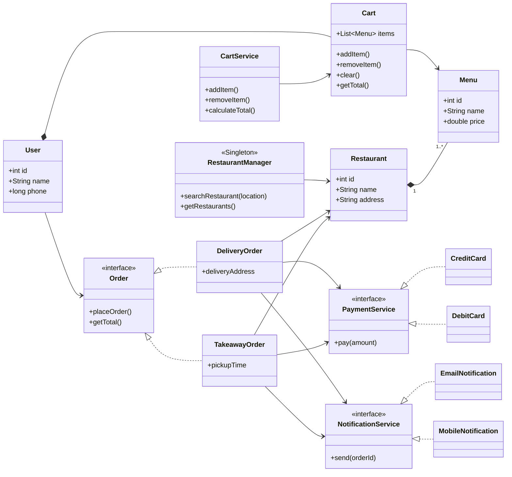
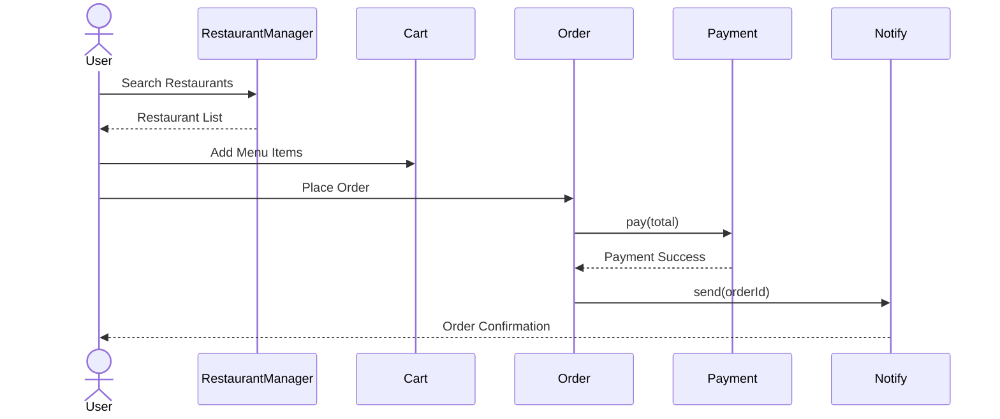
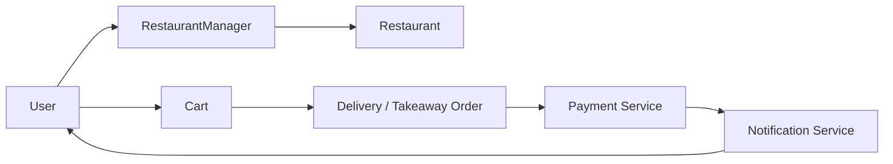

# Food Delivery App - Low Level Design

This document contains the UML diagrams and overall flow of the Food Delivery application.

---

# 1. Class Diagram

---

# 2. Order Placement Flow

---

# 3. Component Flow

---

# 4. Relationships

| Source             | Relation    | Target              |
|--------------------|-------------|---------------------|
| User               | Composition | Cart                |
| Restaurant         | Composition | Menu                |
| RestaurantManager  | Association | Restaurant          |
| CartService        | Association | Cart                |
| DeliveryOrder      | Implements  | Order               |
| TakeawayOrder      | Implements  | Order               |
| CreditCard         | Implements  | PaymentService      |
| DebitCard          | Implements  | PaymentService      |
| EmailNotification  | Implements  | NotificationService |
| MobileNotification | Implements  | NotificationService |

---

# 5. Design Patterns

| Pattern      | Class               |
|--------------|---------------------|
| Singleton    | RestaurantManager   |
| Strategy     | PaymentService      |
| Strategy     | NotificationService |
| Polymorphism | Order Interface     |
| Composition  | User, Restaurant    |

---

# 6. End-to-End Flow

1. User searches nearby restaurants.
2. RestaurantManager returns restaurants.
3. User views menu.
4. Items are added into Cart.
5. User chooses Delivery or Takeaway.
6. Appropriate PaymentService processes payment.
7. NotificationService sends confirmation.
8. Order is completed successfully.