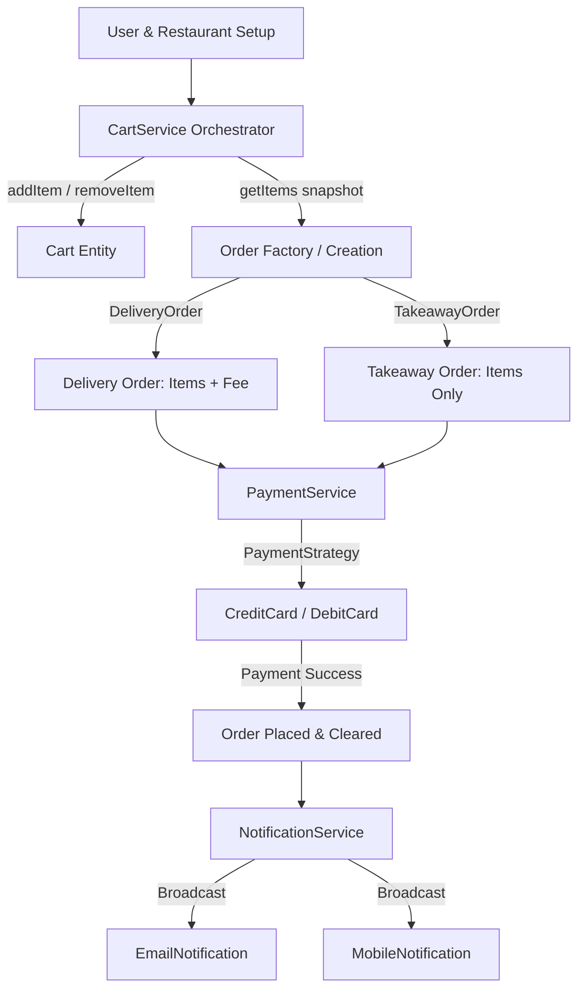
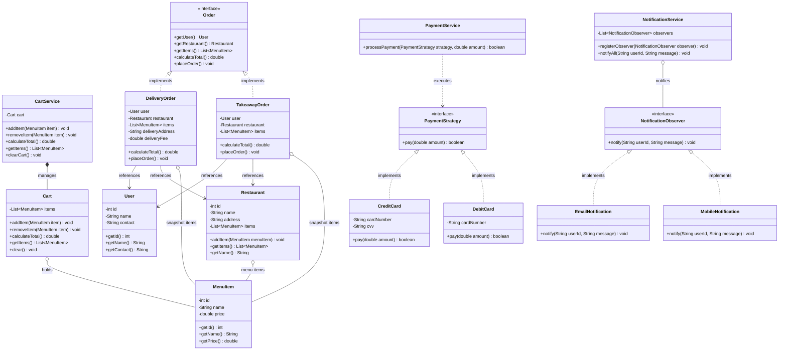
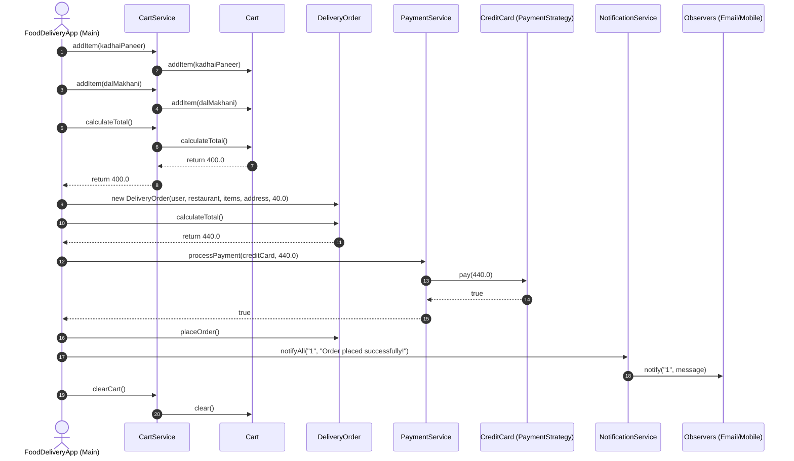

# Food Delivery System - LLD Flow & Architecture

---

## 1. High-Level Architecture Flow

```mermaid
graph TD
    A[User & Restaurant Setup] --> B[CartService Orchestrator]
    B -->|addItem / removeItem| C[Cart Entity]
    B -->|getItems snapshot| D[Order Factory / Creation]
    D -->|DeliveryOrder| E[Delivery Order: Items + Fee]
    D -->|TakeawayOrder| F[Takeaway Order: Items Only]
    E & F --> G[PaymentService]
    G -->|PaymentStrategy| H[CreditCard / DebitCard]
    H -->|Payment Success| I[Order Placed & Cleared]
    I --> J[NotificationService]
    J -->|Broadcast| K[EmailNotification]
    J -->|Broadcast| L[MobileNotification]
```

---

## 2. Class Diagram

```mermaid
classDiagram
    direction TB

    class User {
        -int id
        -String name
        -String contact
        +getId() int
        +getName() String
        +getContact() String
    }

    class MenuItem {
        -int id
        -String name
        -double price
        +getId() int
        +getName() String
        +getPrice() double
    }

    class Restaurant {
        -int id
        -String name
        -String address
        -List~MenuItem~ items
        +addItem(MenuItem menuItem) void
        +getItems() List~MenuItem~
        +getName() String
    }

    class Cart {
        -List~MenuItem~ items
        +addItem(MenuItem item) void
        +removeItem(MenuItem item) void
        +calculateTotal() double
        +getItems() List~MenuItem~
        +clear() void
    }

    class CartService {
        -Cart cart
        +addItem(MenuItem item) void
        +removeItem(MenuItem item) void
        +calculateTotal() double
        +getItems() List~MenuItem~
        +clearCart() void
    }

    class Order {
        <<interface>>
        +getUser() User
        +getRestaurant() Restaurant
        +getItems() List~MenuItem~
        +calculateTotal() double
        +placeOrder() void
    }

    class DeliveryOrder {
        -User user
        -Restaurant restaurant
        -List~MenuItem~ items
        -String deliveryAddress
        -double deliveryFee
        +calculateTotal() double
        +placeOrder() void
    }

    class TakeawayOrder {
        -User user
        -Restaurant restaurant
        -List~MenuItem~ items
        +calculateTotal() double
        +placeOrder() void
    }

    class PaymentStrategy {
        <<interface>>
        +pay(double amount) boolean
    }

    class CreditCard {
        -String cardNumber
        -String cvv
        +pay(double amount) boolean
    }

    class DebitCard {
        -String cardNumber
        +pay(double amount) boolean
    }

    class PaymentService {
        +processPayment(PaymentStrategy strategy, double amount) boolean
    }

    class NotificationObserver {
        <<interface>>
        +notify(String userId, String message) void
    }

    class EmailNotification {
        +notify(String userId, String message) void
    }

    class MobileNotification {
        +notify(String userId, String message) void
    }

    class NotificationService {
        -List~NotificationObserver~ observers
        +registerObserver(NotificationObserver observer) void
        +notifyAll(String userId, String message) void
    }

    Restaurant o-- MenuItem : menu items
    Cart o-- MenuItem : holds
    CartService *-- Cart : manages

    Order <|.. DeliveryOrder : implements
    Order <|.. TakeawayOrder : implements
    DeliveryOrder --> User : references
    DeliveryOrder --> Restaurant : references
    DeliveryOrder o-- MenuItem : snapshot items

    TakeawayOrder --> User : references
    TakeawayOrder --> Restaurant : references
    TakeawayOrder o-- MenuItem : snapshot items

    PaymentStrategy <|.. CreditCard : implements
    PaymentStrategy <|.. DebitCard : implements
    PaymentService ..> PaymentStrategy : executes

    NotificationObserver <|.. EmailNotification : implements
    NotificationObserver <|.. MobileNotification : implements
    NotificationService o-- NotificationObserver : notifies
```

---

## 3. Sequence Trace Diagram

```mermaid
sequenceDiagram
    autonumber
    actor Client as FoodDeliveryApp (Main)
    participant CS as CartService
    participant Cart as Cart
    participant Order as DeliveryOrder
    participant PS as PaymentService
    participant Strategy as CreditCard (PaymentStrategy)
    participant NS as NotificationService
    participant Obs as Observers (Email/Mobile)

    Client->>CS: addItem(kadhaiPaneer)
    CS->>Cart: addItem(kadhaiPaneer)
    Client->>CS: addItem(dalMakhani)
    CS->>Cart: addItem(dalMakhani)

    Client->>CS: calculateTotal()
    CS->>Cart: calculateTotal()
    Cart-->>CS: return 400.0
    CS-->>Client: return 400.0

    Client->>Order: new DeliveryOrder(user, restaurant, items, address, 40.0)
    Client->>Order: calculateTotal()
    Order-->>Client: return 440.0

    Client->>PS: processPayment(creditCard, 440.0)
    PS->>Strategy: pay(440.0)
    Strategy-->>PS: true
    PS-->>Client: true

    Client->>Order: placeOrder()
    Client->>NS: notifyAll("1", "Order placed successfully!")
    NS->>Obs: notify("1", message)

    Client->>CS: clearCart()
    CS->>Cart: clear()
```